# Task List

wtf am I doing here

## Output

|No  |Dokumen|Jumlah|Peruntukan|
|---:|---|---|---|
|1   |Daftar Gaji |3 Rangkap|Pengelola Gaji, Bendahara, Induk (BPKA)|
|2   |Slip Gaji   |46 berkas|ASN dan Tenaga Bantu|

## Timeline

```mermaid
gantt
    dateFormat  D
    title       Timeline Dokumen
    %% excludes    Sunday
    
    %% Today's Marker styling
    todayMarker stroke-width:2px,stroke:#0f0,opacity:0.5

    section Gaji
    Peremajaan Gaji                 :            a1, 1, 15
    Konfirmasi Peremajaan Gaji      : milestone, a2, after a1, 0d
    Cetak Daftar Gaji               :            a3, 15, 20
    Tanda Tangan Daftar Gaji        : milestone, a4, after a3, 0d
    Kirim Daftar Gaji ke BPKA       :            a5, after a4, 30
    Arsip Daftar Gaji               : milestone, a6, after a5, 0d
    Cetak Potongan Gaji (BPD)       :            a7, 20, 26
    Tanda Tangan Potongan Gaji      : milestone, a8, after a7, 0d
    Pembuatan Slip Gaji             :            a9, after a8, 30
    Pencairan Gaji                  : crit,      a10, after a9, 1d
    Pembagian Slip Gaji             :            a11, after a10, 1d
    Backup file Gaji                :            a12, after a11, 2d
    Selesai                         : milestone, a13, after a12, 0d

    section Kepegawaian
    Presensi Pegawai                :            b1, 1, 30
    Proses TPP                      :            b2, 25, 5d
    Pencairan TPP                   : crit,      b3, after b2, 3d
    
```

## Pengelola Kepegawaian

### Bulanan
- TPP
- Rekap Presensi

|Tugas|Keterangan|
|---|---|
|Kenaikan Gaji Berkala|Dibuat paling tidak 2 bulan sebelumnya|
|KP4|Dibuat tiap akhir tahun|
|Dialog Kerja Individu|Diarindu|

## Aplikasi yang digunakan:

|Nama|Fungsi|
|---|---|
|[SIPKD](http://10.100.250.73/)                     |  |
|[SI-INFORMAN](https://si-informan.jogjaprov.go.id/)|  |
|[SIMPEG](https://simpeg2.jogjaprov.go.id/)         |  |
|[Presensi2](https://presensi2.jogjaprov.go.id/)    |  |
|[ASN Memayu](https://asnmemayu.jogjaprov.go.id/)   |  |
