# Task List
Date created : June 11, 2022

Created by   : Odhy

## Pengelola Gaji

Output

|No  |Dokumen|Tanda Tangan|
|---:|---|---|
|1   |Daftar Gaji|

## Timeline

```mermaid
gantt
    dateFormat  D
    title       Timeline
    excludes    Sunday
    
    %% Today's Marker styling
    todayMarker stroke-width:2px,stroke:#0f0,opacity:0.5

    section Gaji
    Peremajaan gaji           : des1, 1, 20
    Hitung gaji               : milestone, des2, after des1, 3d
    Cetak Daftar gaji         : des3, after des2, 1d
    Microsoft Excel           : des4, after des3, 20d
    
```

### SIPKD Gaji

#### Aplikasi yang digunakan:

|Nama|Fungsi|
|---|---|
|[SIPKD](http://10.100.250.73/)                     |  |
|[SI-INFORMAN](https://si-informan.jogjaprov.go.id/)|  |
|[SIMPEG](https://simpeg2.jogjaprov.go.id/)         |  |
|[Presensi2](https://presensi2.jogjaprov.go.id/)    |  |
|[ASN Memayu](https://asnmemayu.jogjaprov.go.id/)   |  |

## Pengelola Kepegawaian

